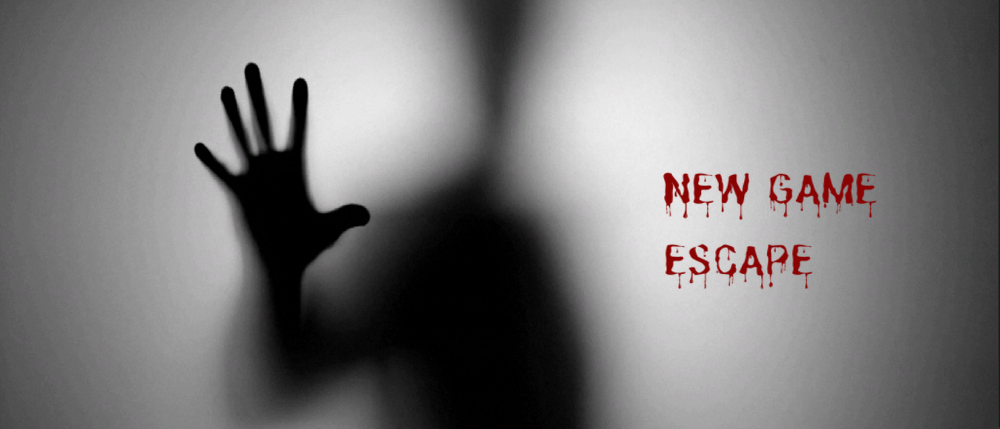
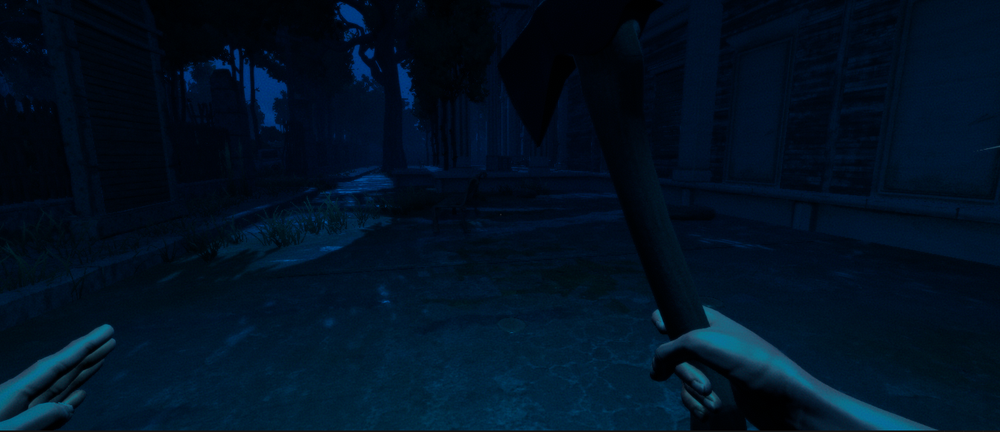
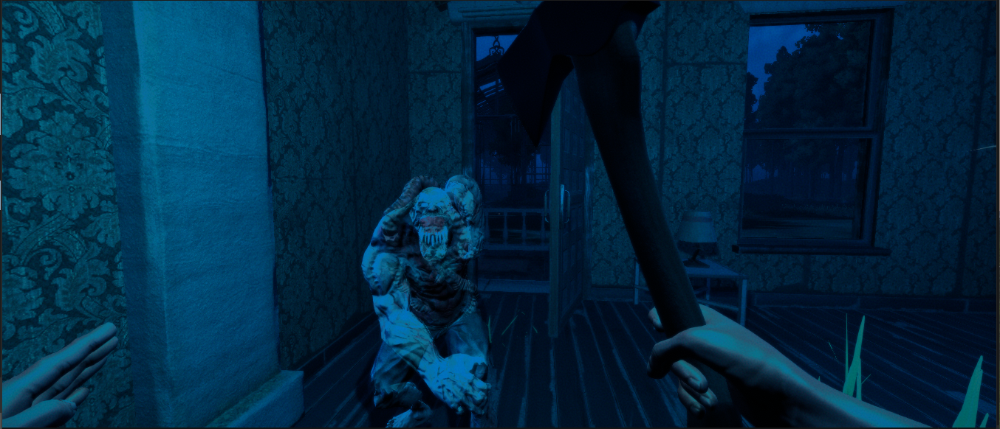

# The Silent Screamer

## Description
This game was developed as a term project for the course Advanced Software Engineering - Winter 2022. It is developed using the Unity framework and C#

## Main Features
-> A 3D map
-> A working inventory to access weapons
-> Interactive animations (ghost attack, ghost hit, player attack, bloosh splash and more)  
-> AI based ghosts of two types (with different healths and animations)
-> Flashlight and nightvision
-> Voice command to use the crossbow

Sources:
For animations and characters: [mixamo.com](https://www.mixamo.com/)
For map and different prefabs: [assetstore.unity.com](https://assetstore.unity.com/)

## Note
More focus of this course was on the documentation of the project. Please find all our documents in the Document folder of this repository.

## Screenshots
Few of the screenshots:

### Main Screen

### The Map

### Ghost Animation

